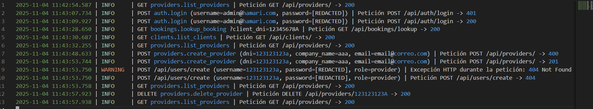
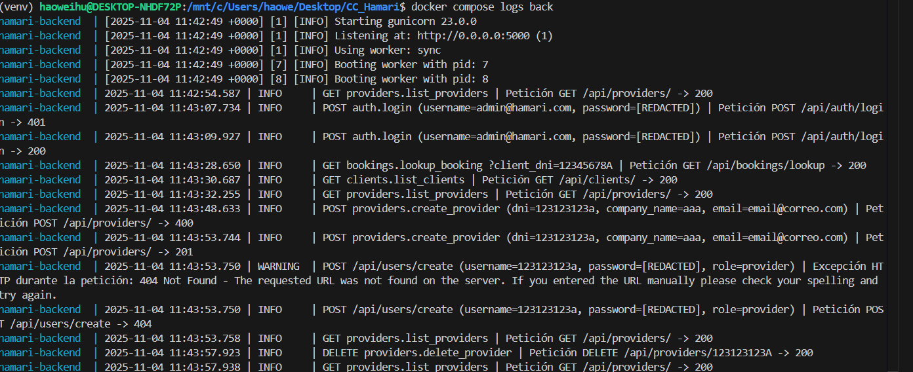
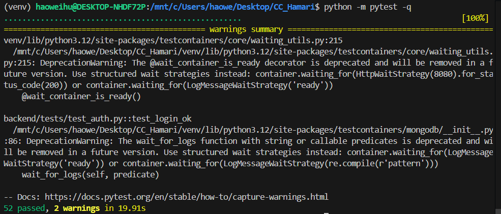

# Hito 3

*Version 0.1*

## Diseño de microservicios

El diseño implementado para el desarrollo del proyecto se basa en una arquitectura compuesta por dos grandes componentes:

1. **La aplicación web (Frontend)**
2. **La API REST (Backend)**

Ambos módulos se comunican a través de peticiones HTTP, y el sistema en su conjunto utiliza una base de datos MongoDB para la persistencia de la información.


## Aplicación Web (Frontend)

El frontend está desarrollado como una Single Page Application (SPA) utilizando **React** y **Vite**, ubicada en el directorio `frontend/`.
Este componente implementa las vistas principales y consume la API a través de funciones definidas en `frontend/src/api.ts`.

Las páginas principales disponibles en la aplicación son:

* `/` — Página principal (Home)
* `/login` — Inicio de sesión
* `/register` — Registro de nuevos usuarios
* `/offers`, `/offers/:id`, `/offers/create` — Gestión y visualización de ofertas
* `/bookings`, `/bookings/lookup` — Consulta y administración de reservas
* `/providers`, `/staff`, `/admin/users` — Secciones administrativas y de gestión interna

---

## API REST (Backend)

El backend está implementado en **Flask** y organizado mediante Blueprints (uno por dominio funcional). Cada dominio se apoya en una capa de servicios ubicada en `backend/services/`, encargada de la lógica de negocio y de las validaciones.

La API se expone bajo el prefijo `/api/*`, e incluye además una ruta raíz (`GET /`). La base de datos utilizada es **MongoDB**, gestionada mediante contenedores definidos en `docker-compose.yml`.

### Dominios y Responsabilidades

* **Auth (`/api/auth`)**
  Gestiona el inicio de sesión, el registro y la emisión/validación de tokens JWT. Incluye tambien la creacion administrativa de los usuarios.

* **Offers (`/api/offers`)**
  Gestiona las ofertas publicadas disponibles en el sitio web

* **Bookings (`/api/bookings`)**
  Controla el ciclo de vida de las reservas: creación, actualización de inventario, cambio de estado.

* **Clients (`/api/clients`)**
  Almacena y gestiona la información de los clientes.

* **Providers (`/api/providers`)**
  Almacena y gestiona la información de los proveedores.

* **Staff (`/api/staff`)**
  Almacena y gestiona la información del personal.


### Convenciones y Estructura de la API

* **Prefijo general:** `/api/<domain>` (por ejemplo: `/api/offers`, `/api/bookings`)

* **Convenciones CRUD por recurso:**

  * `GET /api/<resource>` — Listado de un recurso a especificar
  * `POST /api/<resource>` — Creacion de nuevo recurso
  * `GET /api/<resource>/{id}` — Consulta detallada sobre un recurso concreto
  * `PUT` o `PATCH /api/<resource>/{id}` — Actualización de un recurso concreto
  * `DELETE /api/<resource>/{id}` — Eliminación de un recurso concreto

* **Algunos Endpoints de ejemplo destacados:**

  * `/lookup` — Búsquedas administrativas (ej.: `/api/offers/lookup`)
  * `/api/bookings/{id}/status` — Cambio de estado de una reserva
  * `/api/auth`:

    * `POST /login` — Autenticación de usuarios
    * `POST /register` — Registro de nuevos usuarios
    * `POST /users/create` — Creación administrativa
    * `GET /me` — Información del usuario autenticado

* **Seguridad y gestión de errores:**

  * Autenticación mediante **JWT**, usando el encabezado `Authorization: Bearer <token>`
  * Control de acceso por roles mediante el decorador `require_roles`
  * Códigos de error comunes:

    * `400` — Error de validación
    * `401` — No autorizado
    * `403` — Acceso prohibido
    * `404` — No encontrado

### Ejemplos de Uso

**Autenticación (Login):**

```
POST /api/auth/login
Body: { "username": "user", "password": "pw" }
```

**Consultar disponibilidad de una oferta:**

```
GET /api/offers/{offer_id}/availability?date=10/12/2025
Header: Authorization: Bearer <token>
```

## Sistema de logs

Loguru es la biblioteca utilizada para el sistema de logging del backend. En este proyecto se inicializa en `backend/logging.py` y se encarga de:

- Unificar la salida de logs a consola y fichero.
- Añadir contexto por petición (campo legible `request_summary` y `request_id` para correlación).
- Gestionar rotación diaria y retención de ficheros en `logs/app_YYYY-MM-DD.log`.
- Interceptar el logging estándar y capturar excepciones con su traceback cuando ocurren errores inesperados.

Salida de ejemplo (fichero):



Salida de ejemplo (docker):



## Tests
Tal como se recoge en el hito 2, la suite de pruebas del backend se ejecuta con pytest:

```
python -m pytest -q
```

En la siguiente imagen se puede ver los resultados de una ejecución: 




## Documentación adicional
- [Framework elegido ](./hito3/framework.md)
- [Elección sistema de Logs](./hito3/log.md)
- [Hito 2](hito2.md)