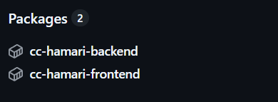

# Hito 4

*Version 0.1*

## Despliegue de microservicios

### Estructura del clúster de contenedores

El despliegue de Hamari se basa en una arquitectura de microservicios orquestados mediante Docker Compose, garantizando un entorno modular, reproducible y fácilmente desplegable. El clúster está compuesto por tres servicios principales definidos en el archivo docker-compose.yml:

- hamari-frontend: Servicio que gestiona el frontend de la aplicación.
- hamari-backend: Servicio que implementa la API de backend.
- hamari-mongo: Servicio que proporciona la base de datos para la aplicación.

Todos los servicios están interconectados dentro de una red interna creada automáticamente por Docker Compose, lo que permite la comunicación directa entre ellos sin necesidad de exponer puertos innecesarios hacia el exterior.

### Configuración de los contenedores
Cada microservicio está definido en su propio Dockerfile, adaptado a su propósito y con imágenes base seleccionadas por equilibrio entre rendimiento, tamaño y estabilidad:

- Frontend: `node:22-alpine (build) + nginx:1.27-alpine (runtime)`
- Backend: `python:3.12-slim`
- Base de datos: `mongo:7`

### Publicación a Github Packages
Este proyecto cuenta con un flujo de integración continua para automatizar la construcción y publicación de las últimas imágenes Docker del frontend y backend.

El workflow Docker Images se ejecuta automáticamente tras la finalización exitosa de los tests o cuando se realiza un push a la rama de pruebas Test.

Las imágenes resultantes se publican en el GitHub Container Registry (GHCR) bajo el namespace del repositorio.

### Ejecución del test para validar el funcionamiento del cluster

La validación del clúster se ha automatizado mediante la integración entre workflows de GitHub Actions:

El workflow principal de tests ejecuta automáticamente las pruebas unitarias y de integración del proyecto diseñadas en el hito 2. Una vez completado con éxito, se lanza el workflow de construcción y publicación  de imágenes Docker, que solo se ejecuta si el anterior ha finalizado sin ningun error. De esta forma, se evita la publicación de imágenes que no hayan superado las pruebas.

## Documentación adicional
- [Imágenes base empleadas](./hito4/base_img.md)
- [Dockerfiles de los Microservicios](./hito4/dockerfiles.md)
- [Composición del clúster](./hito4/compose.md)
- [Github Packages](./hito4/github_pack.md)
- [Hito 2](hito2.md)

