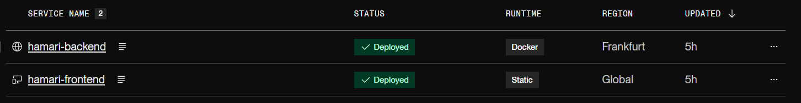
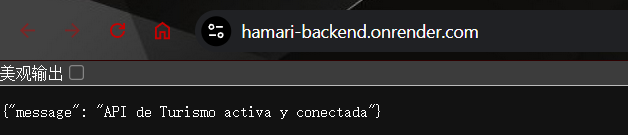
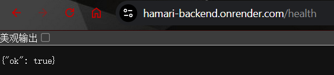
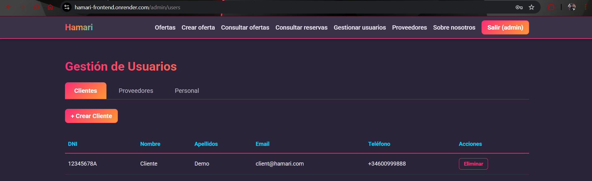
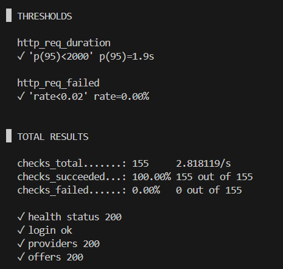
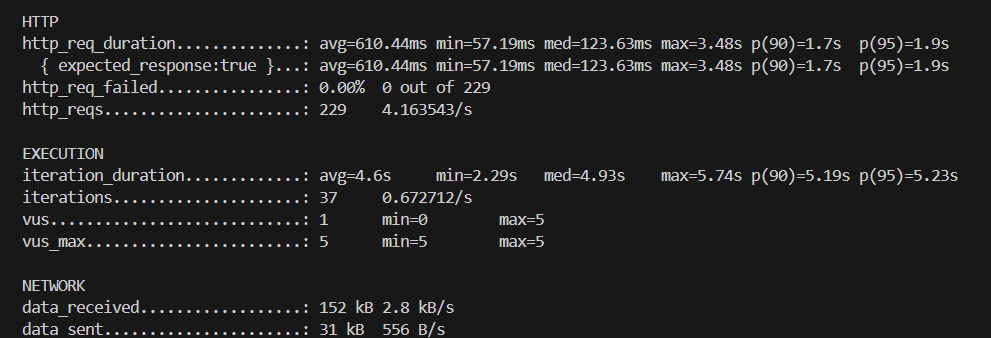

# Hito 5

*Version 0.1*

## Despliegue de los microservicios al PaaS

### Elección de Iaas o Paas
En primer lugar se ha evaluado si desplegar el proyecto sobre un IaaS o sobre un PaaS. Tras el análisis redactado en el fichero de comparativas, se planea usar un PaaS para el proyecto Hamari.

### Comparativa de Plataformas PaaS
Despues se evaluó distintas plataformas que permitan ejecutar microservicios y soportan despliegues mediante contenedores. Se analizaron opciones como Render, Railway, Fly.io, DigitalOcean App Platform y Google App Engine, comparando facilidad de despliegue, soporte nativo de Docker, costes y limitaciones.

### Despliegue de los Servicios en Render

El despliegue de la aplicación Hamari se ha realizado sobre el PaaS Render, utilizando Render Blueprints y el archivo render.yaml como definición declarativa de la infraestructura.

La arquitectura se compone de dos servicios:
- Backend (hamari-backend)
    Desplegado como un Web Service con runtime: docker, utilizando un contenedor Docker personalizado basado en Python y Gunicorn. El backend se ejecuta en la región Frankfurt (Europa) y expone un endpoint /health utilizado tanto para verificación de estado como para monitorización básica del servicio.

- Frontend (hamari-frontend)
    Desplegado como un Static Site (runtime: static), construido a partir de una Single Page Application. Render ejecuta el proceso de construcción (npm ci && npm run build) y sirve el contenido estático generado mediante CDN, eliminando la necesidad de mantener un contenedor activo para el frontend.



La comunicación entre frontend y backend se realiza mediante HTTP(S), configurándose la URL del backend a través de la variable de entorno VITE_API_BASE. La conexión a la base de datos MongoDB se gestiona mediante la variable de entorno MONGO_URI, evitando la inclusión de credenciales en el código fuente.

### Comprobación y observabilidad de la aplicacion

Una vez desplegados los servicios, se ha verificado el correcto funcionamiento de ello. Las comprobaciones realizadas incluyen:

- Estado de los servicios: Ambos servicios aparecen en estado Live en el panel de Render

- Verificación del backend: El endpoint /health del backend responde correctamente con un código HTTP 200 y un mensaje de estado

    
    
    

- Interacción frontend–backend: El frontend desplegado es capaz de comunicarse correctamente con el backend, realizando peticiones HTTP a los endpoints de la API. 
    

- Persistencia de datos: La aplicación se conecta de forma correcta a la base de datos MongoDB Atlas.

Los servicios API y Web son accesibles mediante:

    * API: https://hamari-backend.onrender.com 

    * Frontend: https://hamari-frontend.onrender.com


### Configuración en Github Action

Para el proyecto Hamari se usa CI utilizando GitHub Actions, mientras que el CD es gestionado  por Render.

La pipeline definida sigue la siguiente secuencia:

1. Ejecución de pruebas (CI)
    Se ejecutan workflows independientes para:
    - pruebas del backend (incluyendo MongoDB como servicio),
    - pruebas del frontend,
    - análisis estático y cobertura.

2. Despliegue automático en Render (CD)
El despliegue continuo se realiza automáticamente por Render. Cada vez que se detectan cambios en la rama configurada, Render:
    1. Clona el repositorio.
    2. Interpreta el archivo render.yaml.
    3. Reconstruye los servicios definidos.
    4. Despliega la nueva versión de la aplicación.

### Pruebas de rendimiento 

Para evaluar las prestaciones del backend desplegado en Render se ha utilizado k6, una herramienta orientada a pruebas de carga HTTP. Dado que la aplicación se ejecuta en el plan gratuito del PaaS, se ha definido un escenario de carga ligero, con el objetivo de obtener métricas representativas sin comprometer la estabilidad del servicio.

Escenario de prueba
    * Tipo de prueba: carga ligera con rampa de usuarios (ramping virtual users).
    * Usuarios virtuales máximos: 5.
    * Duración total: 50 segundos.
    * Usuario utilizado: cuenta estándar (no administradora).
    * Endpoints evaluados:
        * GET /health
        * POST /api/auth/login
        * GET /api/providers
        * GET /api/offers
    * Umbrales definidos:
        * Tasa de errores inferior al 2%.
        * Percentil 95 de latencia inferior a 2000 ms.

El script de prueba es k6.js y parametriza credenciales y URL base mediante variables de entorno, facilitando su reutilización. Se puede ejecutar con el siguiente comando: 

```
 docker run --rm -i grafana/k6 run \
  -e BASE_URL=https://hamari-backend.onrender.com \
  -e USER_EMAIL="23456789C" \
  -e USER_PASS="provider123" \
  - < k6.js
```
Tal como se puede ver en la imagen:
- Latencia (http_req_duration): El 95% de las peticiones tardaron menos de 1.9 segundos
- Tasa de errores (http_req_failed): No hubo errores durante la ejecucion de la prueba
- Checks: Todas las comprobaciones pasaron (155 de 155) de las rutas seleccionadas





## Documentación adicional
- [Comparativa Iaas o Paas](./hito5/comparativa.md)
- [Comparativa entre los Paas](./hito5/paas.md)
- [Herramienta de despliegue](./hito5/deploy.md)
- [Despliegue en Github Actions](./hito4/github_deploy.md)
